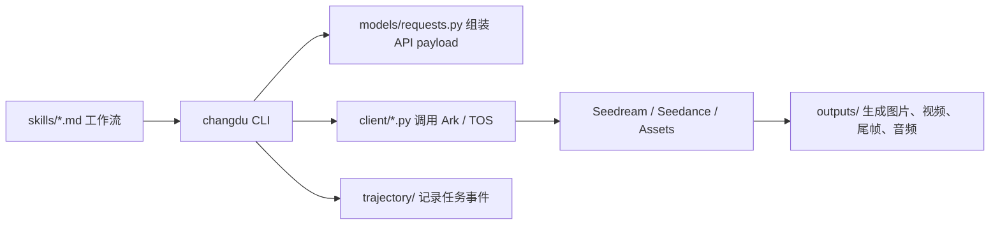

# 项目总览与整理记录

本文档用于快速理解 `changdu-skills` 的边界、源码结构、主要工作流和后续维护重点。

## 1. 项目定位

`changdu-skills` 是一个面向 AI 图像/视频生成的技能包仓库，核心能力围绕火山方舟 Ark API：

- Seedream：文生图、图生图和参考图生成。
- Seedance 2.0：文生视频、多模态参考生视频、尾帧衔接、音色锁定。
- changdu CLI：统一封装生成、资产上传、任务查询、连续生成和后期拼接。
- Codex/OpenClaw skills：把小说拆解、分镜、提示词、生成、审片、后期串成可复用工作流。

## 2. 仓库边界

```text
changdu-skills/
├── changdu/              # Python 包与 Typer CLI 源码
├── skills/               # 每个技能一个 SKILL.md，面向 agent 调用
├── docs/                 # Seedance 提示词指南、剧本文档、项目总览
├── examples/             # 可运行 demo 脚本与 prompt 模板
├── scripts/              # 安装脚本
├── outputs/              # 本机生成产物，已被 .gitignore 忽略
└── README.md             # 对外安装、使用和 demo 入口
```

`outputs/` 当前约 3.1G，属于本地运行产物，不是源码交付面。保留它便于复盘 demo 和短剧生成历史；需要瘦身时可按项目归档或删除，不影响 git 仓库。

## 3. 运行链路



## 4. Python 包结构

`changdu/src/changdu/` 是可安装包主体：

- `cli/main.py`：CLI 入口，加载配置、初始化 `AppContext`，注册 Typer 命令。
- `config.py`：环境变量、配置文件、命令行 override 的优先级合并。
- `models/requests.py`：Seedream/Seedance 请求模型，包含首尾帧模式与参考媒体模式互斥校验。
- `models/responses.py`：图像、视频提交、任务状态响应模型。
- `client/ark_base.py`：Ark HTTP 基础客户端，统一错误映射。
- `client/seedream.py` / `client/seedance.py`：图像和视频生成客户端。
- `client/assets.py` / `client/tos_upload.py`：素材资产库和 TOS 上传。
- `commands/*.py`：新式命令分组；`compat.py` 提供大量对外兼容命令。
- `trajectory/`：本地 run/event 记录。
- `utils.py`：prompt 读取、图片编码、下载、关键帧提取等工具。

当前 `compat.py` 约 2500 行，是主要复杂度集中点。它承载了兼容命令、连续生成、clip 重生成、后期拼接、prompt 检查等能力，后续最适合拆分。

## 5. Skills 结构

`skills/` 下每个目录都是一个独立技能：

- 生成入口：`jimeng-skill`、`generate-image-by-seedream`、`generate-video-by-seedance`。
- 资产与上传：`asset-management`、`upload-to-tos`。
- 文本到视频工作流：`novel-reader`、`character-design`、`text-storyboard`、`storyboard-to-seedance-prompt`、`novel-to-video`。
- 专项制作：`anime-action-scene`。
- 后期与复盘：`video-postproduction`、`video-review`、`ffmpeg-video-processing`。

这些技能的关系是流水线式的：先读文本与抽资产，再做角色/场景/道具参考图，然后产出分镜和 Seedance prompt，最后生成 clip、审查穿帮并后期拼接。

## 6. 示例与文档

- `examples/run_3clip_demo.sh`：3 段写实连贯生成，强调音色锁定和 `ref_video` 衔接。
- `examples/run_30s_anime_action.sh`：6 段动漫武打 demo，强调 anime 风格、自动 fallback、crossfade 与 loudnorm。
- `examples/prompts/anime_action/`：6 段标准武打 prompt 模板。
- `docs/【对外】Seedance 2.0 提示词指南.md`：对外提示词写法。
- `docs/Seedance 2.0提示词常见问题与处理指南.md`：问题排查与修复策略。
- `docs/【剧本】...episodes_all.txt`：输入剧本文本样例。

## 7. 当前健康度

已执行测试：

```bash
cd changdu
../.venv-3.11/bin/python -m pytest -q
```

结果：`25 passed`。

测试覆盖重点：

- Seedance payload 组装，包括图、视频、音频参考和首尾帧互斥。
- Seedance 任务状态解析，包括视频 URL、尾帧、音频 URL、时长和失败原因。
- `clip-concat` filter 生成，包括 crossfade、loudnorm、BGM 混音和 ducking。

## 8. 本次整理已完成

- 梳理了源码、skills、docs、examples、outputs 的职责边界。
- 确认 `outputs/` 为 ignored 本地产物区，未进入 git。
- 修复 `clip-concat` 测试暴露的 BGM helper 缺口。
- 补齐 `changdu clip-add-bgm` 命令，使 README 中的可选 BGM 后期命令有实现支撑。
- 新增本项目总览文档，作为后续维护入口。

## 9. 后续维护建议

1. 拆分 `commands/compat.py`：
   - `compat_generation.py`：text/image/video 生成兼容命令。
   - `compat_assets.py`：asset group、asset create/list/get/delete。
   - `compat_sequence.py`：sequential generate、regen、chain regen。
   - `compat_postproduction.py`：clip concat、trim、tail、voice、BGM。
   - `compat_prompt.py`：prompt optimize/check。

2. 对齐版本信息：
   - `changdu/pyproject.toml` 当前版本是 `0.1.0`。
   - `changdu/README.md` 提到 “v0.2 起”。
   - 发布前建议统一版本号或改成“多模态能力”而非具体版本表述。

3. 补充 CLI 级测试：
   - `clip-add-bgm` 命令参数解析。
   - `load_config` 环境变量和配置文件优先级。
   - `sequential-generate --continuity-mode auto` 的 fallback 分支。

4. 管理本地产物：
   - `outputs/` 可继续作为 ignored 运行区。
   - 大体积成片建议按项目归档到外部存储，避免仓库目录持续膨胀。

5. 强化 demo 可复现性：
   - 示例脚本当前依赖根目录 `.venv-3.11/bin/changdu`。
   - 可以增加一个本地 bootstrap 脚本，自动创建 venv、安装 `changdu` 和校验 ffmpeg。
