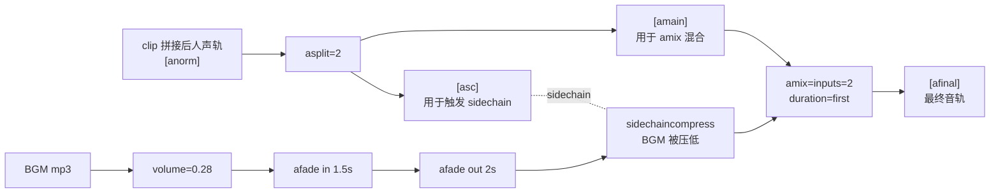

# 多段视频后期工艺 · changdu 命令对照

## 何时调用

- 拼接结果有**段间音量跳变** → `--normalize-audio`（loudnorm）
- 拼接结果有**段间画面硬切** → `--crossfade-seconds 0.3-0.6`
- 已经拼好但想试加 BGM（**默认不推荐**） → `clip-add-bgm`
- 人声被 BGM 盖住（前提是确实加了 BGM） → `--bgm-ducking`（sidechain compressor）

> **关于 BGM 的强烈建议**：Seedance 2.0 已经为每段视频自动生成了人声 + 环境音 + 打斗音，这些音轨**与画面动作严格同步**。再叠加外部 BGM 几乎一定会"打架"——既盖住原声张力，又因风格不匹配让段间割裂感更明显。
>
> 实测结论：**先 `crossfade + loudnorm` 拼一版裸版**，做 A/B 听感对比，**99% 的场景下裸版更连贯、更带感**。BGM 只在做"纯氛围片 / 概念短片 / OP-style 片头"且原声基本无人声台词时才考虑加。

---

## 4 个核心后期工艺

### 1. 视频 crossfade（xfade）

**问题**：两个 clip 直接拼接时，画面会在切换瞬间硬切，大脑感知为"剪辑痕迹"。

**原理**：在前段最后 N 秒和后段开头 N 秒做透明度渐变（fade transition），人眼感知为"自然过渡"。

**ffmpeg 实现**：

```
[v0][v1]xfade=transition=fade:duration=0.4:offset=4.6[vout]
```

`offset` = 前段时长 - duration。多段时累加。

**changdu 命令**：

```bash
changdu clip-concat \
  --input-dir ./clips \
  --output ./final.mp4 \
  --crossfade-seconds 0.4
```

**经验值**：

- 武打/快节奏：0.3-0.4s（再长会糊掉动作）
- 抒情/慢节奏：0.5-0.8s
- 完全硬切（特殊风格）：保留 0.0（默认走 stream copy）

### 2. 音频 acrossfade

视频 xfade 必须配音频 acrossfade，否则音轨会在切换点出现 0.4s 静默或重叠杂音。

**ffmpeg 实现**：

```
[a0][a1]acrossfade=d=0.4:c1=tri:c2=tri[aout]
```

`c1=tri c2=tri` 是三角窗，比默认 `exp` 更平滑。

**changdu**：跟随 `--crossfade-seconds`，自动开。

### 3. loudnorm（音量归一化）

**问题**：每段 Seedance 生成的 clip 有自己的"基准响度"，拼起来可能 C2 突然大声、C4 突然小声。

**原理**：EBU R128 / ITU BS.1770 响度标准，把整段音轨调整到目标响度（默认 -16 LUFS，平台友好），并限峰 -1.5 dBTP。

**ffmpeg 实现**：

```
[aout]loudnorm=I=-16:LRA=11:TP=-1.5[anorm]
```

**changdu 命令**：

```bash
changdu clip-concat ... --normalize-audio
```

**注意事项**：

- loudnorm 会**轻微降低动态范围**（响段更小、静段更大）。武打戏的爆裂感可能略减弱
- 如果原始素材已经动态平衡，可关掉 `--no-normalize-audio`
- 推荐：拼接 ≥3 段时**默认开**

### 4. Sidechain ducking（侧链压缩，**仅在叠 BGM 时**）

> 这一节仅在你已经决定"必须叠 BGM"时才相关。绝大多数 Seedance 拼接场景不需要叠 BGM，详见本文档顶部的 BGM 警告。

**问题**：BGM 和人声都很响时，人声会被 BGM 盖住（"BGM 抢戏"）。

**原理**：用人声轨（sidechain trigger）去触发对 BGM 轨的动态压缩。人声响 → BGM 自动压低 6-10 dB；人声停 → BGM 自动恢复。

**ffmpeg 实现**：

```
[bgm][voice]sidechaincompress=threshold=0.05:ratio=8:attack=200:release=1000[bgmducked];
[voice][bgmducked]amix=inputs=2:duration=first[afinal]
```

**关键参数**：

| 参数 | 含义 | 典型值 |
|---|---|---|
| `threshold` | 触发阈值（0-1） | 0.03-0.08 |
| `ratio` | 压缩比 | 6-10 |
| `attack` | 触发响应（ms） | 100-300 |
| `release` | 释放速度（ms） | 600-1500 |

**changdu 命令**：

```bash
changdu clip-concat ... \
  --bgm ./bgm/battle.mp3 \
  --bgm-volume 0.28 \
  --bgm-ducking
```

`--no-bgm-ducking` 可关闭（适合纯打戏无对白场景，BGM 占主导）。

---

## 完整 BGM 叠加链路



---

## 命令使用矩阵

| 场景 | 推荐 | 命令 |
|---|---|---|
| 拼 6 段武打（保留 Seedance 原声） | ⭐**默认** | `changdu clip-concat -d clips -o final.mp4 --crossfade-seconds 0.4 --normalize-audio` |
| 仅去段间音量跳变 | 常用 | `changdu clip-concat -d clips -o final.mp4 --normalize-audio` |
| 仅做 crossfade（不要响度归一） | 偶用 | `changdu clip-concat -d clips -o final.mp4 --crossfade-seconds 0.4` |
| 默认快速拼接（兼容旧行为） | 调试 | `changdu clip-concat -d clips -o final.mp4`（stream copy） |
| 拼好后才决定要叠 BGM | 仅纯氛围片 | `changdu clip-add-bgm -i final.mp4 --bgm your.mp3 -o final_with_bgm.mp4 --bgm-volume 0.22 --bgm-ducking --normalize-audio` |
| 一步拼接 + BGM + ducking | 仅纯氛围片 | `changdu clip-concat -d clips -o final.mp4 --crossfade-seconds 0.4 --normalize-audio --bgm your.mp3 --bgm-volume 0.22 --bgm-ducking` |

---

## 后期参数推荐表

按内容类型给一组安全默认值（**绝大多数情况下 BGM 应留空**）：

| 内容类型 | crossfade | loudnorm | bgm（推荐） | bgm-volume（如要叠） | ducking | fadein/out |
|---|---|---|---|---|---|---|
| 动漫武打 / 追逐（有人声） | 0.4s | 开 | **空** | — | — | — |
| 写实剧情 / 对话戏 | 0.5s | 开 | **空** | — | — | — |
| 纯动作无台词（空镜动作） | 0.3s | 开 | 可选 | 0.40 | 关 | 1.0 / 2.0 |
| 概念短片 / OP 片头 | 0.6s | 开 | 推荐 | 0.50（BGM 主导） | 关 | 2.0 / 3.0 |
| 抒情空镜（无人声） | 0.8s | 开 | 推荐 | 0.30 | 关 | 3.0 / 4.0 |

---

## 常见问题排查

### Q1: ffmpeg 报 "Unknown encoder 'libx264'"

`brew install ffmpeg` 默认带 libx264。如用静态 build，确认下载的是 "full" 版本（包含 libx264 + libx265 + aac）。

### Q2: BGM 比视频长很多

默认 `-shortest` 会截掉。如要循环短 BGM 覆盖长视频，需要在 BGM 端先用 `aloop=-1` 处理（changdu 当前不内置，可手动 `ffmpeg -stream_loop -1 -i bgm.mp3 -t <视频时长> -c copy bgm_long.mp3` 后再喂 `--bgm`）。

### Q3: BGM 比视频短

`amix=duration=first` 会让 BGM 之后的部分静音。同 Q2，可用 `aloop` 循环。

### Q4: ducking 触发太敏感（BGM 一直被压）

调高 `threshold`（如 0.1）或调低 `ratio`（如 4）。当前 changdu 没暴露这两个参数，可改 `_build_concat_filter_complex` 默认值。

### Q5: ducking 不灵敏（人声响了 BGM 没压下去）

调低 `threshold`（如 0.02）或调高 `ratio`（如 12），同 Q4。

### Q6: 拼完后段切换处仍有 0.1s 黑帧

`xfade` 的 transition 类型可换：`fade`（默认，最自然）、`fadeblack`（强调切割）、`smoothleft`（横向滑动）。当前 changdu 固定 `fade`。

---

## 与其他 skills 的关系

- 上游：[`anime-action-scene`](../anime-action-scene/SKILL.md) / [`storyboard-to-seedance-prompt`](../storyboard-to-seedance-prompt/SKILL.md) 产出 6 段 clip 后调用本 skill
- 旁路：[`ffmpeg-video-processing`](../ffmpeg-video-processing/SKILL.md) 通用 ffmpeg 命令参考（不专门讲后期混音）
- 配套 CLI：`changdu clip-concat`、`changdu clip-add-bgm`、`changdu clip-trim`
